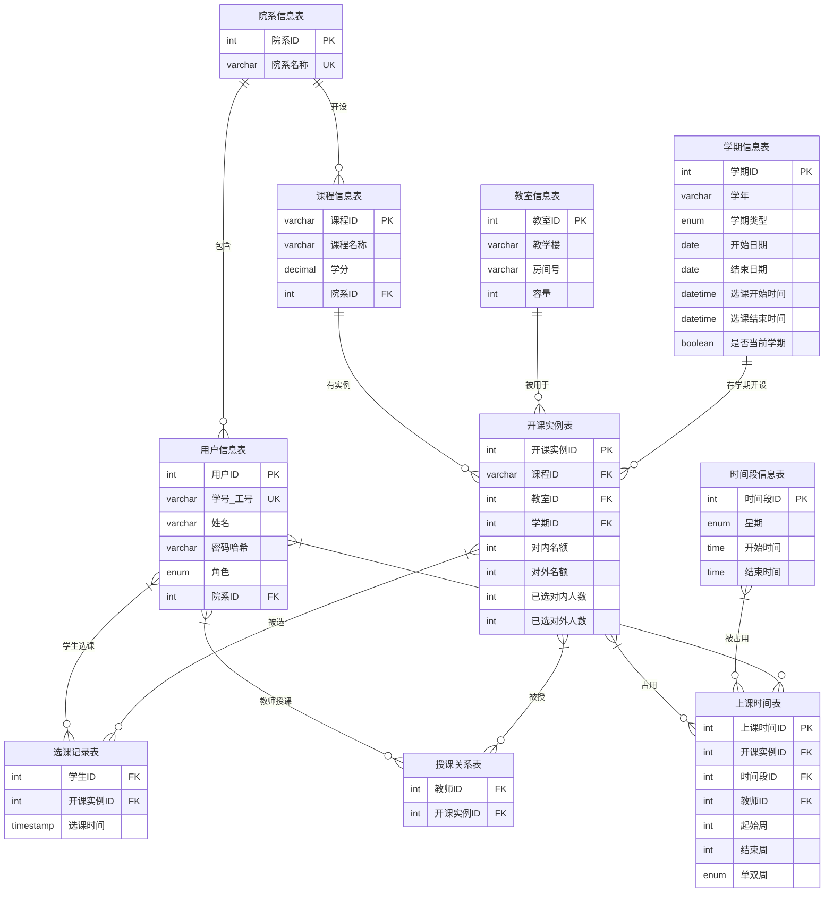

# 《数据库系统原理》大作业 - 系统设计报告

**题目名称：高校智能排课选课管理系统**

**学号及姓名：**
- [学号1] [姓名1]
- [学号2] [姓名2]

**2025年10月27日**

---

## 组内同学承担任务说明

| 学生姓名 | 工作内容 | 工作量占比 |
| :--- | :--- | :--- |
| [姓名1] | 子任务1: 系统功能设计与部分数据库操作实现 | 50% |
| [姓名2] | 子任务2: 系统数据库设计与部分数据库操作实现 | 50% |

---

## 一、需求分析

### 1. 需求描述

本项目旨在设计并实现一个现代化的"**高校智能排课选课管理系统**"。系统的核心目标是规范并自动化高校核心的教务流程，替代传统手动或半自动化的操作方式，以达成以下目标：

- **提升效率**：通过自动化的排课与在线化的选课流程，显著减少教务、教师和学生在这些任务上投入的时间和精力。
- **保证数据准确性与一致性**：利用数据库的约束机制和事务处理，从根本上杜绝因人为疏忽导致的数据错误，特别是通过**智能冲突检测**机制，确保排课计划的合理性。
- **增强信息透明度**：为不同角色的用户提供一个统一的信息门户，使其能够根据权限实时、便捷地获取所需信息，如个人课表、可选课程、学生名单等。
- **提供良好的用户体验**：设计清晰、直观的用户界面和交互流程，降低系统的使用门槛。

系统的范围界定为支持**教务管理员、教师、学生**三类核心用户的日常排课、选课及相关信息查询功能。

#### **用户角色与功能**

系统根据用户的身份，划分了三种不同的角色，并赋予其相应的操作权限：

**（1）教务管理员 (Admin)**

教务管理员是系统的最高权限拥有者，负责系统的后台维护与核心业务调度。其主要功能包括：

1. **基础信息管理**：对院系、教室、课程、学期、教师及学生等基础信息进行统一的增、删、改、查操作。
2. **核心排课功能**：为新学期的课程创建具体的**开课实例**，即为课程指派授课教师、上课时间、上课地点、对内对外名额等。
3. **智能冲突检测**：在执行排课操作时，系统必须自动检测并预警潜在的资源冲突，包括：
   - **教师时间冲突**：同一教师不能在同一时间段讲授不同课程
   - **教室资源冲突**：同一教室不能在同一时间段被多门课程占用
   - **容量约束检测**：课程总容量（对内+对外）不能超过教室容量

**（2）教师 (Teacher)**

教师是教学活动的执行者，系统为其提供教学信息辅助。其主要功能包括：

1. **课表查询**：登录后可查看系统为其自动生成的个人学期授课表，包括授课时间、地点、课程信息。
2. **学生名单查看**：可查看其所教授的每一个开课实例（教学班）的学生选课名单。

**（3）学生 (Student)**

学生是系统的主要用户，系统为其提供便捷的在线选课服务。其主要功能包括：

1. **课程信息查询**：查询本学期所有可选的课程列表及其详细信息（如学分、授课教师、上课时间地点、剩余名额等）。
2. **在线选课/退课**：在规定的选课时间窗口内执行选课或退课操作。该操作受到以下业务规则的严格约束：
   - **时间冲突检测**：系统禁止学生选择与个人课表中已有课程上课时间相冲突的新课程
   - **名额限制**：区分对内名额（本院系学生）和对外名额（外院系学生），当相应名额用尽时阻止选课
   - **选课时间窗口**：只能在学期设定的选课开放时间内进行选课操作
3. **个人课表生成**：选课操作成功后，系统会动态更新并展示学生的个人学期课表。

#### **核心业务规则**

1. **跨院系选课规则**：每个开课实例设置对内名额（本院系学生）和对外名额（外院系学生）。本院系学生选课时占用对内名额，外院系学生选课时占用对外名额。只要有相应名额就可以选课。

2. **多教师授课规则**：一门课程可以由多个教师分时段授课（如前半学期由教师A授课，后半学期由教师B授课）。系统通过授课关系表和上课时间表来支持这一场景。

3. **周次灵活管理规则**：系统支持灵活的周次排课，满足多样化教学需求：
   - **全学期课程**：如理论课，全学期16周每周上课
   - **前/后半学期课程**：如模块化课程，只在前8周或后8周上课
   - **单双周课程**：如实验课，可设置仅在单周或双周上课，实现分组轮换
   - **自定义周次范围**：支持任意周次范围组合，如第3-10周上课

4. **学期管理规则**：每个学期都有明确的选课开始和结束时间，学生只能在此时间窗口内进行选课和退课操作。

### 2. 系统功能设计

系统主要分为四大功能模块：

#### **2.1 基础信息管理模块**（教务管理员）
- 院系信息管理（增删改查）
- 教室信息管理（增删改查）
- 课程信息管理（增删改查）
- 用户信息管理（增删改查）
- 学期信息管理（增删改查）
- 时间段信息管理（增删改查）

#### **2.2 排课管理模块**（教务管理员）
- 创建开课实例（指定课程、学期、教室、名额）
- 分配授课教师（支持多教师分时段授课）
- 安排上课时间（指定具体时间段、授课教师和周次范围）
- 周次灵活管理（支持全学期、前后半学期、单双周等多种模式）
- 排课冲突检测（教师时间冲突、教室资源冲突、容量约束）
- 修改和删除开课实例

#### **2.3 选课管理模块**（学生）
- 查询可选课程列表
- 在线选课（含冲突检测和名额检查）
- 在线退课
- 查看个人课表

#### **2.4 信息查询模块**（教师、学生）
- 教师查看个人授课表
- 教师查看学生选课名单
- 学生查看个人课表
- 学生查看课程详细信息

### 3. 数据流图

#### **3.1 顶层数据流图**

顶层数据流图描绘了系统的整体边界，将"排课选课管理系统"视为单一核心过程，展示了其与三类外部用户（教务、教师、学生）之间的数据交互概貌。

```
[教务管理员] --基础信息、排课指令--> [排课选课管理系统] --排课结果、统计数据--> [教务管理员]
[教师] --查询请求--> [排课选课管理系统] --课表、学生名单--> [教师]
[学生] --选课/退课请求--> [排课选课管理系统] --课程信息、个人课表--> [学生]
```

#### **3.2 0层数据流图**

0层数据流图将核心过程分解为**基础信息管理**、**排课管理**、**选课管理**和**信息查询服务**四大子系统。它详细展示了用户请求如何驱动这些子系统，以及子系统如何与核心数据存储进行交互。

**主要数据流**：
- 基础信息管理 ↔ {院系表, 教室表, 课程表, 用户表, 学期表, 时间段表}
- 排课管理 ↔ {开课实例表, 授课关系表, 上课时间表} + 冲突检测查询
- 选课管理 ↔ {选课记录表, 开课实例表} + 冲突检测查询
- 信息查询 ← 所有相关数据表

### 4. 数据元素表

**数据元素表**（即数据字典）详见第二节"数据库概念模式设计"中的详细定义。核心数据元素包括：

- 用户类：用户ID、学号/工号、姓名、密码、角色、院系
- 课程类：课程ID、课程名称、学分、开设院系
- 资源类：教室ID、教学楼、房间号、容量；时间段ID、星期、开始时间、结束时间
- 学期类：学期ID、学年、学期类型、起止日期、选课时间窗口
- 开课实例类：开课实例ID、课程、教室、学期、对内/对外名额、已选人数
- 关系类：授课关系、选课记录、上课时间安排（含周次范围和单双周设置）

---

## 二、数据库概念模式设计

### 1. 系统初步 E-R 图

系统涉及的核心实体包括：**院系、用户（学生/教师/教务）、课程、教室、时间段、学期、开课实例**。共7个实体，符合6-8个实体的要求。

主要联系包括：
- 院系 - 用户（1:N）：一个院系包含多个用户
- 院系 - 课程（1:N）：一个院系开设多门课程
- 课程 - 开课实例（1:N）：一门课程可以有多个开课实例（不同学期）
- 学期 - 开课实例（1:N）：一个学期有多个开课实例
- 教室 - 开课实例（1:N）：一个教室可以被多个开课实例使用
- 教师 - 开课实例（M:N）：通过授课关系表，支持多教师分时段授课
- 学生 - 开课实例（M:N）：通过选课记录表
- 开课实例 - 时间段（M:N）：通过上课时间表，一个开课实例占用多个时间段

**实体统计**：
- 基础实体：院系、教室、时间段（3个）
- 核心实体：用户、课程、学期、开课实例（4个）
- **总计：7个实体** ✓ 符合6-8个要求

### 2. 系统基本 E-R 图

经过优化和冗余消除后的E-R图如下（使用Mermaid语法）：



### 3. 数据字典

#### **实体表**

**(1) 院系信息表**

| 数据项名   | 数据类型 | 宽度 | 值约束/描述    | 允许空值 |
| :--------- | :------- | :--- | :------------- | :------- |
| `院系ID`   | INT      | 11   | **主键**，自增 | 否       |
| `院系名称` | VARCHAR  | 100  | **唯一约束**   | 否       |

**说明**：存储学校的所有院系信息，如"计算机学院"、"软件学院"等。

**(2) 用户信息表**

| 数据项名    | 数据类型 | 宽度 | 值约束/描述                     | 允许空值 |
| :---------- | :------- | :--- | :------------------------------ | :------- |
| `用户ID`    | INT      | 11   | **主键**，自增                  | 否       |
| `学号_工号` | VARCHAR  | 20   | **唯一约束**，学生学号或员工工号 | 否       |
| `姓名`      | VARCHAR  | 50   | 真实姓名                        | 否       |
| `密码哈希`  | VARCHAR  | 255  | 存储加密后的密码（如bcrypt）    | 否       |
| `角色`      | ENUM     | -    | 值为'学生', '教师', '教务'      | 否       |
| `院系ID`    | INT      | 11   | **外键**，关联`院系信息表`      | 否       |

**说明**：统一存储学生、教师、教务三类用户的基本信息。通过`角色`字段区分用户类型，便于统一认证和权限管理。

**(3) 课程信息表**

| 数据项名   | 数据类型 | 宽度 | 值约束/描述                     | 允许空值 |
| :--------- | :------- | :--- | :------------------------------ | :------- |
| `课程ID`   | VARCHAR  | 20   | **主键**，课程代码 (如 'CS101') | 否       |
| `课程名称` | VARCHAR  | 100  | 课程名称                        | 否       |
| `学分`     | DECIMAL  | 3, 1 | 学分 (如 3.0)，>0               | 否       |
| `院系ID`   | INT      | 11   | **外键**，关联`院系信息表`      | 否       |

**说明**：存储课程的抽象、静态定义。`院系ID`表示该课程由哪个院系开设。

**(4) 教室信息表**

| 数据项名 | 数据类型 | 宽度 | 值约束/描述                          | 允许空值 |
| :------- | :------- | :--- | :----------------------------------- | :------- |
| `教室ID` | INT      | 11   | **主键**，自增                       | 否       |
| `教学楼` | VARCHAR  | 50   | 教学楼名称                           | 否       |
| `房间号` | VARCHAR  | 20   | 房间号码                             | 否       |
| `容量`   | INT      | 11   | 教室容量，>0                         | 否       |
| -        | -        | -    | **唯一约束**：(`教学楼`, `房间号`)组合 | -        |

**说明**：存储所有可用于排课的教室资源。教学楼和房间号组合唯一标识一个教室。

**(5) 时间段信息表**

| 数据项名   | 数据类型 | 宽度 | 值约束/描述                            | 允许空值 |
| :--------- | :------- | :--- | :------------------------------------- | :------- |
| `时间段ID` | INT      | 11   | **主键**，自增                         | 否       |
| `星期`     | ENUM     | -    | 值为'星期一'至'星期日'                 | 否       |
| `开始时间` | TIME     | -    | 时间段开始时间                         | 否       |
| `结束时间` | TIME     | -    | 时间段结束时间                         | 否       |
| -          | -        | -    | **唯一约束**：(`星期`, `开始时间`, `结束时间`)组合 | -        |

**说明**：定义学校上课的基本时间单元。例如："星期一 08:00-09:40"代表第1-2节课。星期、开始时间、结束时间组合唯一，防止重复定义。

**(6) 学期信息表**

| 数据项名       | 数据类型 | 宽度 | 值约束/描述                   | 允许空值 |
| :------------- | :------- | :--- | :---------------------------- | :------- |
| `学期ID`       | INT      | 11   | **主键**，自增                | 否       |
| `学年`         | VARCHAR  | 10   | 如 '2025'                     | 否       |
| `学期类型`     | ENUM     | -    | 值为'春季', '秋季'            | 否       |
| `开始日期`     | DATE     | -    | 学期开始日期                  | 否       |
| `结束日期`     | DATE     | -    | 学期结束日期                  | 否       |
| `选课开始时间` | DATETIME | -    | 选课开放时间                  | 是       |
| `选课结束时间` | DATETIME | -    | 选课截止时间                  | 是       |
| `是否当前学期` | BOOLEAN  | 1    | 标记当前学期，默认FALSE       | 否       |

**说明**：管理学期信息，支持选课时间窗口控制。每个学期都有明确的选课时间范围，学生只能在此时间段内选课。

**(7) 开课实例表**

| 数据项名       | 数据类型 | 宽度 | 值约束/描述                     | 允许空值 |
| :------------- | :------- | :--- | :------------------------------ | :------- |
| `开课实例ID`   | INT      | 11   | **主键**，自增                  | 否       |
| `课程ID`       | VARCHAR  | 20   | **外键**，关联`课程信息表`      | 否       |
| `教室ID`       | INT      | 11   | **外键**，关联`教室信息表`      | 否       |
| `学期ID`       | INT      | 11   | **外键**，关联`学期信息表`      | 否       |
| `对内名额`     | INT      | 11   | 本院系学生可选名额，>0          | 否       |
| `对外名额`     | INT      | 11   | 外院系学生可选名额，>=0         | 否       |
| `已选对内人数` | INT      | 11   | 已选的本院系学生数，默认0       | 否       |
| `已选对外人数` | INT      | 11   | 已选的外院系学生数，默认0       | 否       |

**说明**：系统的核心枢纽表，记录课程在特定学期的具体安排。一个开课实例是一门课程在某个学期的具体实施，包括教室、名额等信息。

**业务约束**：
- `已选对内人数` <= `对内名额`
- `已选对外人数` <= `对外名额`
- `对内名额` + `对外名额` <= 教室容量

#### **联系表**

**(8) 授课关系表**（教师 M:N 开课实例）

| 数据项名     | 数据类型 | 宽度 | 值约束/描述                               | 允许空值 |
| :----------- | :------- | :--- | :---------------------------------------- | :------- |
| `教师ID`     | INT      | 11   | **复合主键**，**外键**，关联`用户信息表` | 否       |
| `开课实例ID` | INT      | 11   | **复合主键**，**外键**，关联`开课实例表` | 否       |

**说明**：连接教师和开课实例的多对多关系表。支持一个开课实例由多个教师分时段授课，或一个教师教授多个开课实例。复合主键保证同一教师不会重复关联到同一开课实例。

**(9) 选课记录表**（学生 M:N 开课实例）

| 数据项名     | 数据类型  | 宽度 | 值约束/描述                               | 允许空值 |
| :----------- | :-------- | :--- | :---------------------------------------- | :------- |
| `学生ID`     | INT       | 11   | **复合主键**，**外键**，关联`用户信息表` | 否       |
| `开课实例ID` | INT       | 11   | **复合主键**，**外键**，关联`开课实例表` | 否       |
| `选课时间`   | TIMESTAMP | -    | 默认CURRENT_TIMESTAMP                     | 否       |

**说明**：连接学生和开课实例的多对多关系表，记录学生的选课情况。`选课时间`用于记录选课操作的时间戳。复合主键保证学生不能重复选择同一门课程。

**(10) 上课时间表**（开课实例 M:N 时间段，支持周次管理和多教师授课）

| 数据项名     | 数据类型 | 宽度 | 值约束/描述                                | 允许空值 |
| :----------- | :------- | :--- | :----------------------------------------- | :------- |
| `上课时间ID` | INT      | 11   | **主键**，自增                             | 否       |
| `开课实例ID` | INT      | 11   | **外键**，关联`开课实例表`                 | 否       |
| `时间段ID`   | INT      | 11   | **外键**，关联`时间段信息表`               | 否       |
| `教师ID`     | INT      | 11   | **外键**，关联`用户信息表`，指明该时段授课教师 | 是       |
| `起始周`     | INT      | 11   | 周次范围开始，1-20，默认1                  | 否       |
| `结束周`     | INT      | 11   | 周次范围结束，1-20，默认16                 | 否       |
| `单双周`     | ENUM     | -    | 值为'全部', '单周', '双周'，默认'全部'     | 否       |

**唯一约束**：(`开课实例ID`, `时间段ID`, `起始周`, `结束周`, `单双周`)

**说明**：连接开课实例和时间段的多对多关系表，支持灵活的周次管理。同一个开课实例可以在同一时间段的不同周次范围内安排课程，满足多样化的排课需求。

**周次管理特性**：
- **全学期课程**：起始周=1，结束周=16，单双周='全部'（如理论课）
- **前半学期**：起始周=1，结束周=8（如模块化课程前半部分）
- **后半学期**：起始周=9，结束周=16（如模块化课程后半部分）
- **单周课程**：单双周='单周'（如实验课A组，第1/3/5/7...周上课）
- **双周课程**：单双周='双周'（如实验课B组，第2/4/6/8...周上课）

**多教师授课支持**：`教师ID`字段用于支持多教师分时段授课的场景。当一个开课实例由多个教师分时段授课时，不同的时间段或周次范围可以对应不同的教师ID，实现"前半学期教师A授课，后半学期教师B授课"的业务场景。

**业务约束**：
- `起始周` >= 1 AND `起始周` <= 20
- `结束周` >= 1 AND `结束周` <= 20
- `结束周` >= `起始周`

---

## 三、数据库逻辑模式设计与优化

### 1. 数据库关系模式定义

由E-R图得到的关系模式如下：

**（1）实体关系模式**

- **院系信息**(院系ID, 院系名称)
- **用户信息**(用户ID, 学号_工号, 姓名, 密码哈希, 角色, 院系ID)
- **课程信息**(课程ID, 课程名称, 学分, 院系ID)
- **教室信息**(教室ID, 教学楼, 房间号, 容量)
- **时间段信息**(时间段ID, 星期, 开始时间, 结束时间)
- **学期信息**(学期ID, 学年, 学期类型, 开始日期, 结束日期, 选课开始时间, 选课结束时间, 是否当前学期)
- **开课实例**(开课实例ID, 课程ID, 教室ID, 学期ID, 对内名额, 对外名额, 已选对内人数, 已选对外人数)

**（2）联系关系模式**

- **授课关系**(教师ID, 开课实例ID)
- **选课记录**(学生ID, 开课实例ID, 选课时间)
- **上课时间**(上课时间ID, 开课实例ID, 时间段ID, 教师ID, 起始周, 结束周, 单双周)

### 2. 关系模式范式等级的判定与规范化

#### **（1）实体关系模式的范式分析**

**院系信息关系**：
- 码：`院系ID`
- 函数依赖：`院系ID → 院系名称`
- 范式等级：**3NF**
- 分析：所有非主属性完全函数依赖于码，且不存在传递依赖。

**用户信息关系**：
- 码：`用户ID`（候选码：`学号_工号`）
- 函数依赖：
  - `用户ID → {学号_工号, 姓名, 密码哈希, 角色, 院系ID}`
  - `学号_工号 → {用户ID, 姓名, 密码哈希, 角色, 院系ID}`
- 范式等级：**3NF**
- 分析：所有非主属性完全函数依赖于码，不存在部分依赖和传递依赖。`院系ID`作为外键，不构成传递依赖。

**课程信息关系**：
- 码：`课程ID`
- 函数依赖：`课程ID → {课程名称, 学分, 院系ID}`
- 范式等级：**3NF**
- 分析：所有非主属性完全函数依赖于码，不存在传递依赖。

**教室信息关系**：
- 码：`教室ID`（候选码：(`教学楼`, `房间号`)）
- 函数依赖：
  - `教室ID → {教学楼, 房间号, 容量}`
  - `(教学楼, 房间号) → {教室ID, 容量}`
- 范式等级：**3NF**
- 分析：所有非主属性完全函数依赖于码，不存在传递依赖。

**时间段信息关系**：
- 码：`时间段ID`（候选码：(`星期`, `开始时间`, `结束时间`)）
- 函数依赖：
  - `时间段ID → {星期, 开始时间, 结束时间}`
  - `(星期, 开始时间, 结束时间) → 时间段ID`
- 范式等级：**3NF**
- 分析：所有非主属性完全函数依赖于码。

**学期信息关系**：
- 码：`学期ID`
- 函数依赖：`学期ID → {学年, 学期类型, 开始日期, 结束日期, 选课开始时间, 选课结束时间, 是否当前学期}`
- 范式等级：**3NF**
- 分析：所有非主属性完全函数依赖于码，不存在传递依赖。

**开课实例关系**：
- 码：`开课实例ID`
- 函数依赖：`开课实例ID → {课程ID, 教室ID, 学期ID, 对内名额, 对外名额, 已选对内人数, 已选对外人数}`
- 范式等级：**3NF**
- 分析：所有非主属性完全函数依赖于码，不存在传递依赖。

#### **（2）联系关系模式的范式分析**

**授课关系**：
- 码：(`教师ID`, `开课实例ID`)
- 函数依赖：无非主属性
- 范式等级：**3NF**（实际上是BCNF）
- 分析：只有码属性，自动满足3NF。

**选课记录关系**：
- 码：(`学生ID`, `开课实例ID`)
- 函数依赖：`(学生ID, 开课实例ID) → 选课时间`
- 范式等级：**3NF**
- 分析：唯一的非主属性`选课时间`完全函数依赖于码。

**上课时间关系**：
- 码：`上课时间ID`
- 候选码：(`开课实例ID`, `时间段ID`, `起始周`, `结束周`, `单双周`)
- 函数依赖：`上课时间ID → {开课实例ID, 时间段ID, 教师ID, 起始周, 结束周, 单双周}`
- 范式等级：**3NF**
- 分析：所有非主属性完全函数依赖于主键，不存在部分依赖和传递依赖。候选码的组合唯一约束保证了同一开课实例在同一时间段的同一周次范围内只能有一条记录。

#### **（3）规范化结论**

**所有关系模式均已达到3NF**，满足大作业要求。具体分析如下：

1. **1NF（第一范式）**：所有关系模式中的属性都是原子值，不存在多值属性或嵌套关系。

2. **2NF（第二范式）**：对于所有关系模式，非主属性都完全函数依赖于码，不存在部分函数依赖。

3. **3NF（第三范式）**：对于所有关系模式，非主属性既不部分依赖于码，也不传递依赖于码。所有外键引用都不构成传递依赖，因为它们代表的是实体间的直接关联关系。

### 3. 数据库关系模式优化

#### **（1）关系模式的简化**

1. **消除1:N联系的中间表**：
   - 院系-用户（1:N）：通过在`用户信息表`中添加`院系ID`外键实现
   - 院系-课程（1:N）：通过在`课程信息表`中添加`院系ID`外键实现
   - 课程-开课实例（1:N）：通过在`开课实例表`中添加`课程ID`外键实现
   - 学期-开课实例（1:N）：通过在`开课实例表`中添加`学期ID`外键实现
   - 教室-开课实例（1:N）：通过在`开课实例表`中添加`教室ID`外键实现

2. **保留M:N联系的中间表**：
   - 教师-开课实例（M:N）：通过`授课关系表`实现，支持多教师授课
   - 学生-开课实例（M:N）：通过`选课记录表`实现，记录选课信息
   - 开课实例-时间段（M:N）：通过`上课时间表`实现，支持一门课多个时间段

#### **（2）数据冗余的处理**

1. **已选人数的冗余存储**：
   - `开课实例表`中的`已选对内人数`和`已选对外人数`属性理论上可以通过统计`选课记录表`获得
   - 但为了提高查询效率（选课时需要频繁检查剩余名额），我们选择冗余存储
   - 需要通过触发器保证数据一致性：选课时`+1`，退课时`-1`

2. **避免其他冗余**：
   - 不在`选课记录表`中存储课程名称、上课时间等信息，通过关联查询获取
   - 不在`开课实例表`中存储课程名称、学分等静态信息，保持规范化

#### **（3）约束条件的设计**

1. **主键约束**：所有表都定义了主键，保证实体唯一性

2. **外键约束**：所有外键引用都设置了外键约束，保证参照完整性

3. **唯一约束**：
   - `院系信息表.院系名称`：防止院系名称重复
   - `用户信息表.学号_工号`：防止学号/工号重复
   - `教室信息表.(教学楼, 房间号)`：防止同一教室重复定义
   - `时间段信息表.(星期, 开始时间, 结束时间)`：防止时间段重复定义

4. **检查约束**（通过触发器或应用层实现）：
   - `开课实例表.对内名额 > 0`
   - `开课实例表.对外名额 >= 0`
   - `开课实例表.已选对内人数 <= 对内名额`
   - `开课实例表.已选对外人数 <= 对外名额`
   - `开课实例表.(对内名额 + 对外名额) <= 教室容量`
   - `课程信息表.学分 > 0`
   - `教室信息表.容量 > 0`

---

## 四、数据库物理设计

### 1. 存储引擎选择

选择 **InnoDB** 作为存储引擎，理由如下：
- 支持事务处理（ACID特性），确保选课、排课等关键操作的数据一致性
- 支持外键约束，保证参照完整性
- 支持行级锁，提高并发性能（选课高峰期多个学生同时选课）
- 支持崩溃恢复，保证数据安全

### 2. 索引设计

#### **（1）主键索引**（自动创建）
- 所有表的主键都会自动创建聚簇索引

#### **（2）唯一索引**
```sql
-- 用户信息表
CREATE UNIQUE INDEX uk_学号_工号 ON 用户信息表(学号_工号);

-- 院系信息表
CREATE UNIQUE INDEX uk_院系名称 ON 院系信息表(院系名称);

-- 教室信息表
CREATE UNIQUE INDEX uk_教学楼_房间号 ON 教室信息表(教学楼, 房间号);

-- 时间段信息表
CREATE UNIQUE INDEX uk_时间段 ON 时间段信息表(星期, 开始时间, 结束时间);
```

#### **（3）外键索引**（自动创建）
外键字段会自动创建索引，包括：
- `用户信息表.院系ID`
- `课程信息表.院系ID`
- `开课实例表.课程ID`、`教室ID`、`学期ID`
- `授课关系表.教师ID`、`开课实例ID`
- `选课记录表.学生ID`、`开课实例ID`
- `上课时间表.开课实例ID`、`时间段ID`、`教师ID`

#### **（4）性能优化索引**

```sql
-- 1. 用户表：按角色查询（如查询所有教师、所有学生）
CREATE INDEX idx_角色 ON 用户信息表(角色);

-- 2. 开课实例表：按学期查询（查询当前学期的所有课程）
CREATE INDEX idx_学期 ON 开课实例表(学期ID);

-- 3. 开课实例表：组合索引，用于快速查找某学期某课程的开课实例
CREATE INDEX idx_学期_课程 ON 开课实例表(学期ID, 课程ID);

-- 4. 选课记录表：按选课时间排序
CREATE INDEX idx_选课时间 ON 选课记录表(选课时间);

-- 5. 学期信息表：快速查询当前学期
CREATE INDEX idx_当前学期 ON 学期信息表(是否当前学期);

-- 6. 上课时间表：周次范围查询优化
CREATE INDEX idx_周次范围 ON 上课时间表(起始周, 结束周);
```

### 3. 存取路径分析

#### **（1）高频查询场景及存取路径**

**场景1：学生查询可选课程列表**
```sql
-- 查询某学期的所有开课实例
SELECT * FROM 开课实例表 WHERE 学期ID = ?
-- 存取路径：使用 idx_学期 索引，快速定位
```

**场景2：学生选课时的时间冲突检测（含周次范围）**
```sql
-- 查询学生已选课程与新课程是否时间冲突
SELECT COUNT(*) FROM 选课记录表 sc
JOIN 上课时间表 t1 ON sc.开课实例ID = t1.开课实例ID
JOIN 上课时间表 t2 ON t2.开课实例ID = ?  -- 新课程ID
WHERE sc.学生ID = ?
  AND t1.时间段ID = t2.时间段ID
  -- 周次范围重叠检查
  AND t1.起始周 <= t2.结束周
  AND t1.结束周 >= t2.起始周
  -- 单双周冲突检查
  AND (t1.单双周 = '全部' OR t2.单双周 = '全部' OR t1.单双周 = t2.单双周)
-- 存取路径：使用 选课记录表.学生ID 和 上课时间表.时间段ID 索引
```

**场景3：教务排课时的教师时间冲突检测（含周次范围）**
```sql
-- 查询某教师在某时间段某周次范围是否已有课
SELECT COUNT(*) FROM 授课关系表
JOIN 上课时间表 ON 授课关系表.开课实例ID = 上课时间表.开课实例ID
WHERE 授课关系表.教师ID = ? 
  AND 上课时间表.时间段ID = ?
  -- 周次范围重叠检查
  AND 上课时间表.起始周 <= ?  -- 新课程结束周
  AND 上课时间表.结束周 >= ?  -- 新课程起始周
  -- 单双周冲突检查
  AND (上课时间表.单双周 = '全部' OR ? = '全部' OR 上课时间表.单双周 = ?)  -- 新课程单双周
-- 存取路径：使用 授课关系表.教师ID 外键索引
```

**场景4：教师查看学生名单**
```sql
-- 查询某开课实例的所有选课学生
SELECT * FROM 选课记录表
JOIN 用户信息表 ON 选课记录表.学生ID = 用户信息表.用户ID
WHERE 开课实例ID = ?
-- 存取路径：使用 选课记录表.开课实例ID 外键索引
```

#### **（2）存储空间估算**

假设系统规模：
- 院系：10个
- 用户：10000人（学生8000，教师1500，教务500）
- 课程：500门
- 教室：200个
- 时间段：50个（每周5天×每天10个时间段）
- 学期：10个（历史数据）
- 开课实例：2000个/学期
- 选课记录：80000条/学期（平均每学生10门课）

**存储空间粗略估算**：
- 院系信息表：10行 × 0.1KB ≈ 1KB
- 用户信息表：10000行 × 0.5KB ≈ 5MB
- 课程信息表：500行 × 0.2KB ≈ 100KB
- 教室信息表：200行 × 0.1KB ≈ 20KB
- 时间段信息表：50行 × 0.1KB ≈ 5KB
- 学期信息表：10行 × 0.2KB ≈ 2KB
- 开课实例表：2000行 × 0.3KB ≈ 600KB
- 授课关系表：3000行 × 0.1KB ≈ 300KB
- 选课记录表：80000行 × 0.2KB ≈ 16MB
- 上课时间表：6000行 × 0.15KB ≈ 900KB（增加周次字段后略增）

**总计：约 23MB**（不含索引），数据量较小，适合使用InnoDB引擎。

### 4. 数据库安全性与完整性设计

#### **（1）安全性设计**

1. **密码加密**：`用户信息表.密码哈希`使用bcrypt等强加密算法
2. **角色权限**：通过`用户信息表.角色`字段区分权限，应用层实现权限控制
3. **SQL注入防护**：使用参数化查询（预编译语句）

#### **（2）完整性设计**

1. **实体完整性**：主键约束
2. **参照完整性**：外键约束，级联操作策略：
   - 删除院系时：`RESTRICT`（如果有用户或课程则禁止删除）
   - 删除用户时：`RESTRICT`（如果是学生且有选课记录则禁止删除）
   - 删除开课实例时：`CASCADE`（级联删除授课关系、选课记录、上课时间）
3. **用户定义完整性**：通过触发器实现业务约束检查

---

## 五、总结

本设计文档完成了"高校智能排课选课管理系统"的完整数据库设计，主要工作包括：

1. **需求分析**：明确了教务、教师、学生三类用户的功能需求，设计了四大功能模块，绘制了数据流图。

2. **概念模式设计**：设计了包含7个核心实体的E-R图，符合6-8个实体的要求。通过3个M:N联系表实现了复杂的业务关系。

3. **逻辑模式设计**：将E-R图转换为10个关系模式，并进行了详细的范式分析，确认所有关系都达到了3NF，满足规范化要求。

4. **物理设计**：选择了InnoDB存储引擎，设计了完善的索引体系，分析了主要查询的存取路径，确保系统性能。

**设计亮点**：

- ✅ **跨院系选课**：通过对内/对外名额设计，灵活支持跨院系选课需求
- ✅ **多教师授课**：通过授课关系表和上课时间表的教师ID字段，支持多教师分时段授课
- ✅ **周次灵活管理**：支持全学期、前后半学期、单双周等多种排课模式，满足实验课轮换等复杂场景
- ✅ **学期管理**：独立的学期表支持选课时间窗口控制
- ✅ **冲突检测**：数据库设计支持教师时间冲突、教室资源冲突、学生时间冲突的完整检测（含周次重叠和单双周匹配）
- ✅ **性能优化**：合理的索引设计和冗余字段（已选人数），平衡了规范化和性能

**下一步工作**：

1. 编写建表SQL脚本
2. 设计触发器实现业务约束
3. 设计存储过程实现核心功能
4. 编写测试数据和查询SQL

---

**附录：关键业务规则SQL伪代码**

```sql
-- 学生选课业务规则检查
PROCEDURE 学生选课(学生ID, 开课实例ID)
BEGIN
    -- 1. 检查选课时间窗口
    IF 当前时间 NOT BETWEEN 学期.选课开始时间 AND 学期.选课结束时间 THEN
        RAISE ERROR '不在选课时间内';
    END IF;
    
    -- 2. 判断是对内还是对外
    IF 学生.院系ID = 课程.院系ID THEN
        -- 对内选课
        IF 已选对内人数 >= 对内名额 THEN
            RAISE ERROR '对内名额已满';
        END IF;
    ELSE
        -- 对外选课
        IF 已选对外人数 >= 对外名额 THEN
            RAISE ERROR '对外名额已满';
        END IF;
    END IF;
    
    -- 3. 检查时间冲突（含周次范围和单双周）
    IF EXISTS (
        SELECT 1 FROM 选课记录表 sc1
        JOIN 上课时间表 ct1 ON sc1.开课实例ID = ct1.开课实例ID
        JOIN 上课时间表 ct2 ON ct2.开课实例ID = 新课程ID
        WHERE sc1.学生ID = 当前学生ID
          AND ct1.时间段ID = ct2.时间段ID
          -- 周次范围重叠
          AND ct1.起始周 <= ct2.结束周
          AND ct1.结束周 >= ct2.起始周
          -- 单双周冲突
          AND (ct1.单双周 = '全部' OR ct2.单双周 = '全部' OR ct1.单双周 = ct2.单双周)
    ) THEN
        RAISE ERROR '上课时间冲突';
    END IF;
    
    -- 4. 选课成功，插入记录
    INSERT INTO 选课记录表 VALUES (学生ID, 开课实例ID, NOW());
    
    -- 5. 更新已选人数
    UPDATE 开课实例表 SET 已选对内人数 = 已选对内人数 + 1 WHERE ...;
END;
```
